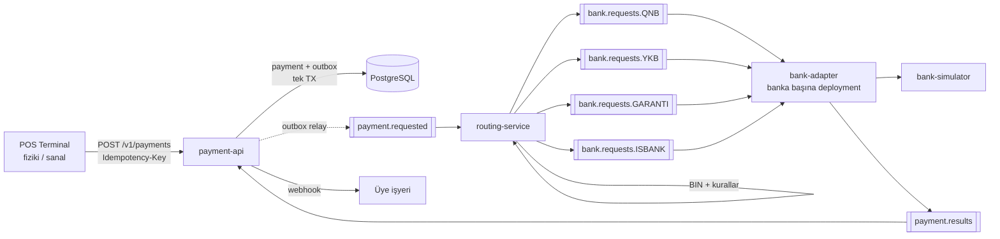
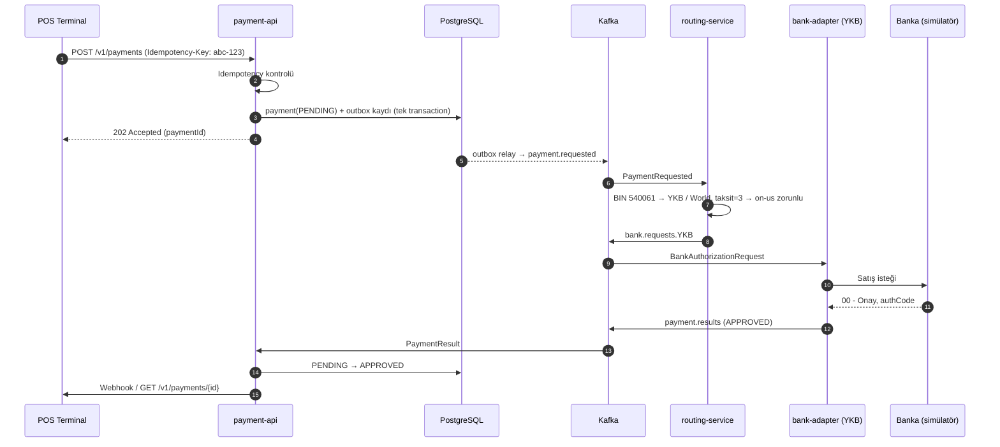
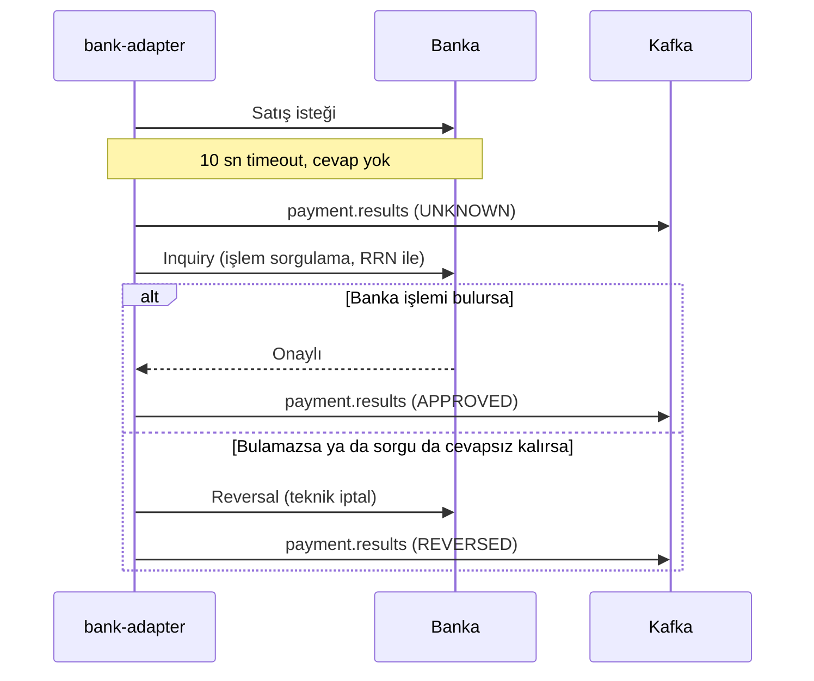
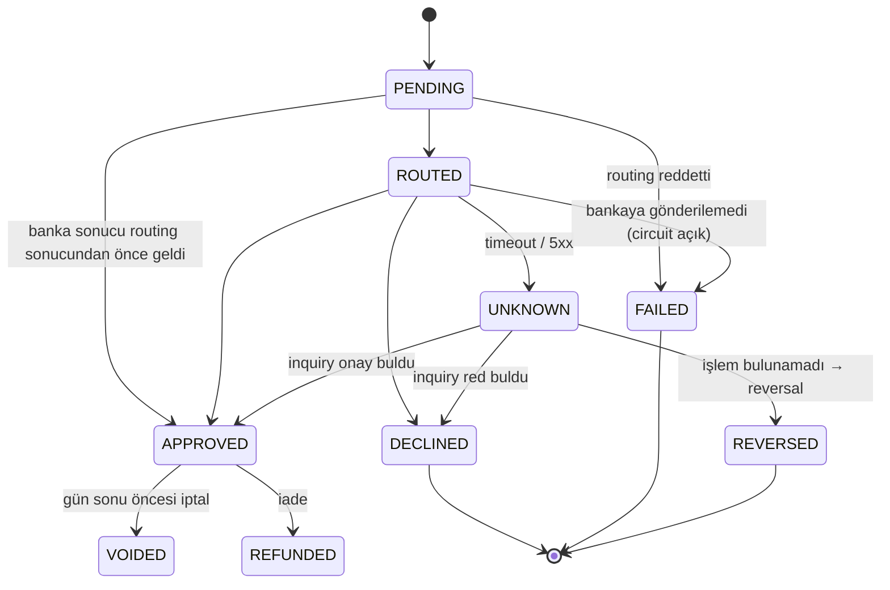

# Ödeme Akışı

## 1. Genel mimari

## 2. Başarılı satış akışı

## 3. Kritik senaryo: banka cevap vermedi

Timeout olan satış isteği **asla retry edilmez**. Banka parayı çekmiş olabilir. Retry, çift çekim demektir.
Detaylı akış ve gerçek ortamda denenen senaryolar: [05-banka-entegrasyonu.md](05-banka-entegrasyonu.md)

## 4. Payment state machine

