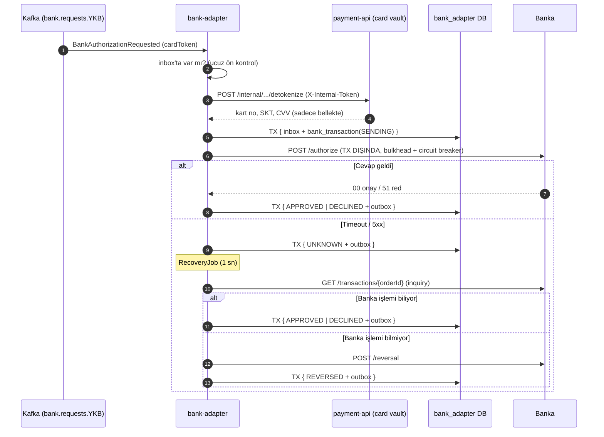

# Banka Entegrasyonu: bank-adapter, Card Vault ve "Cevap Gelmedi" Senaryosu

## 1. Akış



Banka sonucu `payment.bank.results` üzerinden payment-api'ye gider. payment-api ilk sonuçla birlikte kart verisini
vault'tan siler.

## 2. Hata sınıflandırması

Bütün tasarım tek bir soruya dayanıyor: **İstek bankaya ulaştı mı?**

| Hata | Bankaya ulaştı mı? | Sonuç | Circuit'i açar mı? |
|---|---|---|---|
| Bağlantı kurulamadı | Kesinlikle hayır | `FAILED` | Evet |
| Circuit açık / bulkhead dolu | Hayır, gönderilmedi | `FAILED` | - |
| Banka 4xx döndü | Ulaştı ama işlemedi | `FAILED` | Hayır |
| Cevap zaman aşımı | **Bilinmiyor** | `UNKNOWN` → inquiry | Evet |
| Banka 5xx döndü | **Bilinmiyor** (işleyip sonra patlamış olabilir) | `UNKNOWN` → inquiry | Evet |
| Banka reddetti (51, 05, 54) | Evet, işlendi | `DECLINED` | **Hayır**, başarılı çağrı |

## 3. Cevapsız işlemin çözülmesi

```
UNKNOWN ──inquiry──► banka biliyor      → bankanın sonucu (APPROVED / DECLINED / REVERSED)
        │
        ├──────────► banka bilmiyor      → REVERSING → reversal → REVERSED
        │             (istek hâlâ yolda olabilir; reversal orderId'yi iptal eder,
        │              asıl istek sonradan ulaşırsa banka reddeder)
        │
        └──────────► inquiry başarısız   → 2 sn, 4 sn, 8 sn... (5 deneme) → REVERSING
                                                                            │
                                            reversal başarısız (10 deneme) → MANUAL_REVIEW + alarm
```

**Satış isteği neden retry edilmiyor?** Timeout olan istek bankaya ulaşıp para çekmiş olabilir. Tekrar göndermek çift
çekim demek. Banka tarafında `orderId` idempotency'si olsa bile (simülatörde var), buna güvenilmez. Her bankanın
sanal POS'u bunu garanti etmiyor.

**Inquiry işlemi bulamazsa neden yine de reversal?** "Bulunamadı" demek "hiç gelmedi" demek değil. İstek bankanın bir
kuyruğunda bekliyor olabilir ve biz sorguladıktan sonra işlenebilir. Reversal, orderId'yi bankada iptal olarak
işaretliyor; geç gelen asıl istek reddediliyor.

## 4. Card vault

- Kart verisi (kart numarası, SKT, CVV) payment-api'de, ödeme ile **aynı transaction**'da AES-256-GCM ile şifrelenip yazılıyor.
- Kafka'ya sadece rastgele bir `cardToken` (UUID) gidiyor. Kafka log'u PCI kapsamı dışında kalıyor.
- bank-adapter kart verisini bankaya göndermeden **hemen önce** alıyor. Veri sadece bellekte tutuluyor, DB'ye ve log'a yazılmıyor (`toString` maskeli).
- İlk banka sonucu geldiğinde kart verisi siliniyor. PCI DSS, CVV'nin yetkilendirme sonrasında (şifreli bile olsa) saklanmasını yasaklıyor. Inquiry ve reversal kart verisi değil, orderId ile yapılıyor.
- Bankaya hiç ulaşamayan ödemeler için 15 dakikalık TTL var.
- `/internal/**` uç noktası `X-Internal-Token` ile korunuyor. Production'da bu uç nokta ingress'e açılmamalı, mTLS / service mesh kullanılmalı.

## 5. Banka izolasyonu

| Mekanizma | Ne sağlıyor |
|---|---|
| Banka başına listener container ve consumer group | YKB'nin yavaş mesajı QNB'nin consumer thread'ini bekletmiyor. YKB'deki bir rebalance QNB'yi durdurmuyor. |
| Banka başına circuit breaker | YKB çöktüğünde sadece YKB'ye istek gönderilmiyor. |
| Banka başına bulkhead (20 eş zamanlı çağrı) | Yavaş bir banka tüm HTTP bağlantılarını ve thread'leri tüketemiyor. |
| Banka çağrısı transaction dışında | Banka 5 sn cevap vermezse DB connection 5 sn tutulmuyor. |

## 6. Circuit breaker ve otomatik routing

```
YKB çöktü → 5 çağrıdan %50'si hata → circuit OPEN → bank.health {YKB, healthy=false}
          → routing-service: YKB işlem almaz → tek çekim QNB'ye, taksitli reddedilir
10 sn sonra → HALF_OPEN → echo probu (ISO 8583 0800) × 3
          ├─ başarısız → tekrar OPEN
          └─ başarılı  → CLOSED → bank.health {YKB, healthy=true} → routing YKB'yi geri alır
```

**Neden echo probu?** Circuit açılınca routing o bankaya işlem göndermeyi bırakıyor. Gerçek trafik gelmediği için
circuit'i kapatacak deneme çağrıları da gelmiyor ve circuit sonsuza kadar açık kalıyor. Echo, trafiğe bağlı olmadan
bankanın durumunu test ediyor.

## 7. Gerçek ortamda denenen senaryolar

Dört servis birlikte çalıştırılarak (`docker compose` + `spring-boot:run`) denendi.

| Senaryo | Sonuç |
|---|---|
| World kart, 3 taksit | `APPROVED` / YKB, authCode döndü |
| Tutar ...,51 | `DECLINED` / 51 "Yetersiz bakiye" |
| YKB işlemi yapıyor, cevap 8 sn gecikiyor (timeout 5 sn) | 7. sn'de `UNKNOWN` → 13. sn'de inquiry ile `APPROVED`. Bankaya **1** satış isteği gitti. Kart verisi silindi. |
| YKB tamamen kapalı | İlk işlemler `UNKNOWN`, circuit `OPEN`, routing `healthy=false` |
| YKB kapalıyken World tek çekim | Otomatik olarak **QNB**'ye gitti, `APPROVED` |
| YKB kapalıyken World 3 taksit | `FAILED` (program bankası kapalı) |
| YKB düzeldi | `HALF_OPEN → CLOSED`, routing `healthy=true`, yeni işlem YKB'ye gitti |
| Çöküş sırasında `UNKNOWN` kalan 2 işlem | YKB düzelince inquiry "bulunamadı" dedi → reversal → `REVERSED`, para çekilmedi |

## 8. Denemek için

```bash
# Bankanın cevabını geciktir (işlem yapılır, cevap geç gelir)
curl -s -X PUT localhost:8090/v1/admin/banks/YKB/chaos -H 'Content-Type: application/json' \
  -d '{"down":false,"latencyMs":0,"failureRate":0,"lateResponseRate":1,"lateResponseMs":8000}'

# Bankayı tamamen kapat
curl -s -X PUT localhost:8090/v1/admin/banks/YKB/chaos -H 'Content-Type: application/json' \
  -d '{"down":true,"latencyMs":0,"failureRate":0,"lateResponseRate":0,"lateResponseMs":0}'

# İzleme
curl -s localhost:8083/v1/admin/circuits
curl -s localhost:8083/v1/admin/transactions/<paymentId>
curl -s localhost:8082/v1/admin/banks
```

Simülatörde tutarın son iki hanesi sonucu belirliyor: `.51` yetersiz bakiye, `.05` onaylanmadı, `.54` süresi dolmuş kart.
